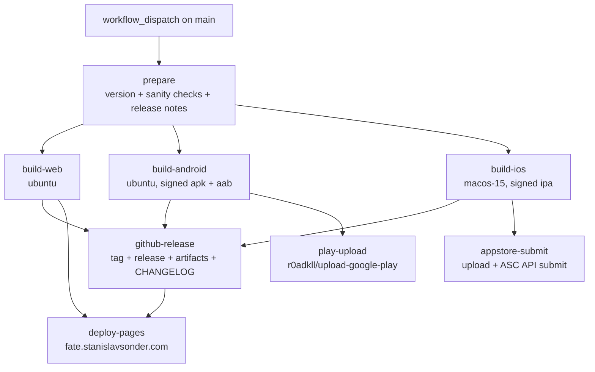

# Deployment Pipeline — Overview

Automated release pipeline for FATE: Core across **Web (PWA)**, **Android (Play Store)**, and **iOS (App Store)**, driven entirely by GitHub Actions. Goal: after merging a release PR, a single button press publishes everything — no more manual visits to Play Console or App Store Connect.

This ships in **1.4.0**, ahead of the 2.0.0 mods work. Phases 0–1 are done; start at Phase 2.

## Target release flow

1. **Develop on a version branch** (e.g. `1.4.0`). Run `pnpm version-bump:patch|minor|major` on it — the existing `scripts/version-bump/index.ts` keeps `package.json`, Android `versionCode`/`versionName`, and iOS `MARKETING_VERSION`/`CURRENT_PROJECT_VERSION` in sync.
2. **Open PR `1.4.0` → `main`.** The existing `tests.yml` workflow (lint, audit, build, unit, e2e) gates the merge. Merge it.
3. **Press the button:** GitHub → Actions → **Release** → *Run workflow* (on `main`). The workflow then automatically:
   - runs sanity checks (version consistency, tag doesn't already exist)
   - generates release notes from conventional commits since the last tag
   - builds web, Android (`.apk` + `.aab`), and iOS (`.ipa`) bundles in parallel
   - creates a git tag `vX.Y.Z` + GitHub Release with all artifacts attached and the changelog as description
   - uploads the `.aab` to Google Play (production track) with "what's new" text
   - uploads the `.ipa` to App Store Connect, attaches it to a new App Store version, and submits for review
   - deploys the PWA to GitHub Pages at **https://fate.stanislavsonder.com**

## Workflow architecture

The repo is **public**, so all runners — including the macOS runner needed for iOS — are free.

## Phases

Each phase leaves the pipeline in a working, useful state. Do them in order.

- [x] **[Phase 0 — Prerequisites](phase-0-prerequisites.md)**: keystore, service accounts, API keys, DNS, repo hygiene — **done 2026-07-25**; all credentials verified live (Play draft-edit test, ASC apps query). Only open note: confirm Play App Signing status in Play Console.
- [x] **[Phase 1 — Release workflow + GitHub Release](phase-1-release-workflow-and-github-release.md)**: the button → tag + GitHub Release with apk/aab/ipa/web artifacts and auto-changelog
- [ ] **[Phase 2 — PWA on GitHub Pages](phase-2-pwa-github-pages.md)**: deploy `dist/` to `fate.stanislavsonder.com`
- [ ] **[Phase 3 — Play Store](phase-3-play-store.md)**: auto-publish the `.aab` to the production track
- [ ] **[Phase 4 — App Store](phase-4-app-store.md)**: upload `.ipa` + auto-submit for review via the App Store Connect API
- [ ] **[Phase 5 — Optional improvements](phase-5-optional-improvements.md)**: staged rollouts, caching, metadata automation

## GitHub secrets (complete list)

Configure under repo **Settings → Secrets and variables → Actions**. Set up in Phase 0; consumed in Phases 1–4.

| Secret | Used by | Contents |
|---|---|---|
| `ANDROID_KEYSTORE_BASE64` | build-android | Upload keystore file, base64-encoded |
| `ANDROID_KEYSTORE_PASSWORD` | build-android | Keystore password |
| `ANDROID_KEY_ALIAS` | build-android | Key alias (e.g. `upload`) |
| `ANDROID_KEY_PASSWORD` | build-android | Key password |
| `PLAY_SERVICE_ACCOUNT_JSON` | play-upload | Full JSON key of the Google Cloud service account |
| `ASC_KEY_ID` | build-ios, appstore-submit | App Store Connect API key ID |
| `ASC_ISSUER_ID` | build-ios, appstore-submit | App Store Connect issuer ID |
| `ASC_PRIVATE_KEY` | build-ios, appstore-submit | Contents of the `.p8` private key file |

## Key facts about the current repo state

- CI: `.github/workflows/tests.yml` (PR/main gate) and `.github/workflows/release.yml` (manual Release: signed web/Android/iOS artifacts + GitHub Release). Store uploads and Pages are Phases 2–4.
- Version source of truth: `package.json` (`1.4.0`), synced by `scripts/version-bump/index.ts`. Android is at `versionCode 19 / versionName 1.4.0` (`android/app/build.gradle`), iOS at `MARKETING_VERSION 1.4.0 / CURRENT_PROJECT_VERSION 19` (`ios/App/App.xcodeproj/project.pbxproj`).
- **Android has no release signing config at all** — release builds are currently unsigned. Fixed in Phase 0.
- **iOS** uses automatic signing, team `M9KUDJFFFS`.
- **Bundle IDs differ by platform** (intentional, cannot be changed after first store publish): Android/Capacitor `com.sonder.fate_core`, iOS `com.sonder.fatecore`.
- PWA: `vite-plugin-pwa` configured in `vite.config.mts` (`registerType: 'autoUpdate'`, static `public/site.webmanifest`), Vite `base` is `/` — correct for a custom (sub)domain.
- `pnpm build:android` / `build:ios` end with `npx cap open …` (interactive) — CI uses `pnpm build:android:ci` / `build:ios:ci` (`cap sync` only) + Gradle/xcodebuild.
- Commits follow Conventional Commits (enforced by commitlint + husky) — this powers the auto-changelog.
